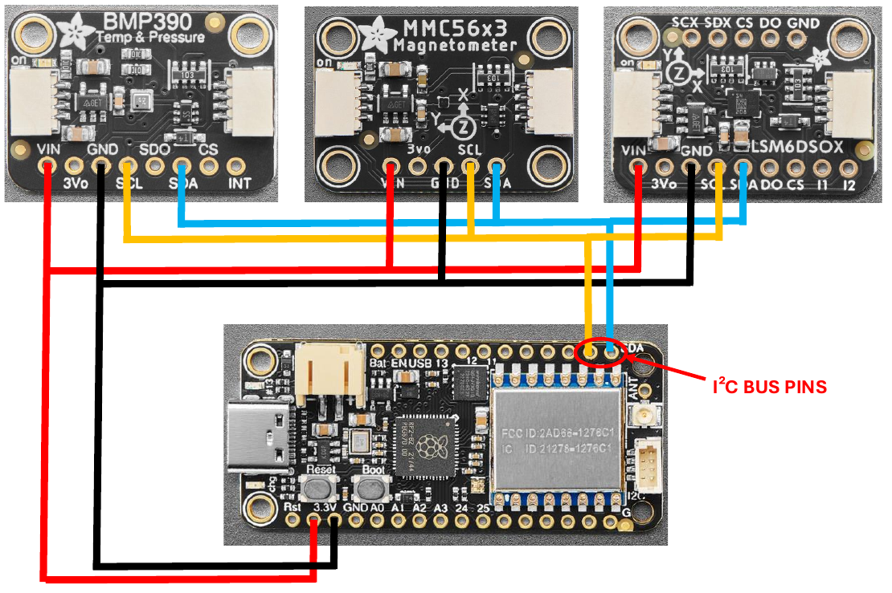

# FreeRTOS Experiment Framework

- **Institution:** University of Kansas
- **Course:** EECS 753 (Embedded & Real-Time Systems)

This project explores a highly popular open-source RTOS for embedded platforms (FreeRTOS), by designing and deploying a software framework built around it on a resource-constrained microcontroller unit (MCU), the Adafruit Feather RP2040 with RFM95. Moreover, a RT taskset is designed around three external sensor modules sharing a data bus, and the effects of shared resource contention and an attacker task are analyzed.

*Note: This is a fork of* [earendil_SAR_system](https://github.com/leo-cabezas/earendil_SAR_system)*, and thus borrows part of its codebase to facilitate development.*

# Objectives
- Schedule a set of tasks in a freely available RTOS for a given target embedded platform.
- Design and implement a task scheduling experiment in an RTOS, including mechanisms to log
and process relevant task data (e.g. execution time, deadline misses).
- Measure the real-world effects of shared resource contention on a set of RT tasks, and how they
are partially mitigated by applying well-known priority inheritance mechanism (e.g. PIP).
- Design and implement a simple "attacker task" which targets a shared resource, and measure the
effects of the attack on other tasks (e.g. increased execution times, induced deadline misses

# Deployment instructions

## A. Required Hardware

<figure align="center">
  
  <figcaption><em>Figure 1: Hardware diagram for the experimental setup.</em></figcaption>
</figure>
<br><br>

| Component | Product link | Relevant standards | Cost |
| :-------- | :-------- | :----------------- | :---------------------- |
| Microcontroller board | [Adafruit Feather RP2040 with RFM95 LoRa Radio - 915MHz - RadioFruit and STEMMA QT](https://www.adafruit.com/product/5714) | UART, SPI, I²C, USB | 1 x $29.95 |
| Magnetometer | [Adafruit Triple-axis Magnetometer - MMC5603 - STEMMA QT / Qwiic](https://www.adafruit.com/product/5579) | I²C | 1 x $5.95 |
| Precision Altimeter | [Adafruit BMP390 - Precision Barometric Pressure and Altimeter - STEMMA QT / Qwiic](https://www.adafruit.com/product/4816) | I²C | 1 x $10.95 |
| Accelerometer + Gyroscope | [Adafruit LSM6DSOX 6 DoF Accelerometer and Gyroscope - STEMMA QT / Qwiic](https://www.adafruit.com/product/4438) | I²C | 1 x $11.95 |

**Total cost:** $58.80 (as of 2026-06-21)

# B. Software dependencies

### B.1. Required software dependencies

The following is a comprehensive list of all software dependencies that users are **REQUIRED** to install themselves to be able to compile this repository, along with instructions and clarifications.

- [**pico-sdk (2.2.0)**](https://github.com/raspberrypi/pico-sdk)
  
  *Note: Perform the following actions after cloning pico-sdk.*
```
cd [path_to_pico_sdk]
```
```
git submodule update --init
```  
- [**FreeRTOS-Kernel (11.2.0)**](https://github.com/FreeRTOS/FreeRTOS-Kernel)
- [**picotool (2.2.0)**](https://github.com/raspberrypi/pico-sdk-tools/releases)

  *Note: Download picotool-2.2.0-a4-x86_64-lin.tar.gz if your computer has an x86_64 architecture.*
  
- [**CMake (>=3.13)**](https://github.com/Kitware/CMake)
- [**ARM GNU Toolchain**](https://developer.arm.com/downloads/-/arm-gnu-toolchain-downloads)
  
  *Note: Ensure that the ARM GNU Toolchain is available in your $PATH.*

### B.2. Pre-installed software dependencies

This repository already contains most of the required software dependencies for interfacing with the external sensor modules. **The user is NOT required to install these dependencies themselves**; we list them here only for the sake of clarity and transparency:

- [Adafruit_BMP3XX](https://github.com/adafruit/Adafruit_BMP3XX)
- [Adafruit_BusIO](https://github.com/adafruit/Adafruit_BusIO)
- [Adafruit_LSM6DS](https://github.com/adafruit/Adafruit_LSM6DS)
- [Adafruit_MMC56x3](https://github.com/adafruit/Adafruit_MMC56x3)
- [Adafruit_Sensor](https://github.com/adafruit/Adafruit_Sensor)
- [arduino-pico](https://github.com/earlephilhower/arduino-pico)
- [ArduinoCore-API](https://github.com/arduino/ArduinoCore-API)

## C. Compilation instructions (Linux)

### C.1. Handheld / Node compilation instructions

- **Step 1:** Navigate to /build in your CLI:
```
cd [path_to_repo]/build
```

- **Step 2:** Generate the project's Makefile using CMake and the provided CMakeLists.txt:

```
cmake .. -DEARENDIL_EXPERIMENTAL=ON -DPICO_SDK_PATH=[path_to_pico-sdk] -DFREERTOS_KERNEL_PATH=[path_to_FreeRTOS-Kernel] -DPICOTOOL_PATH=[path_to_picotool]
```

If pico-sdk, FreeRTOS-Kernel, and picotool are all located in your $HOME, you can simply do
```
cmake .. -DEARENDIL_EXPERIMENTAL=ON
```
instead.

- **Step 3:** Use the Makefile to generate the project's .uf2 file.
```
make
```
You will use this .uf2 file in section C.2 to program the Adafruit Feather RP2040 + RFM95 via its on-board FLASH memory.

### C.2. File upload instructions

- **Step 1:** Grab a data-capable USB-C cable and plug it into the Feather's USB-C port.
 
- **Step 2** - Press and hold the 'Boot' button on the Adafruit Feather RP2040 + RFM95.

- **Step 3** - While holding the 'Boot' button, plug the other end of the cable into your computer.

- **Step 4** - Release the 'Boot' button. The Feather should be recognized as storage volume 'RPI-RP2'.

- **Step 5** - Mount the 'RPI-RP2' storage volume and upload the project's .uf2 to it.

***Done! The Feather should be now programmed and functional.***

# How it works

- Download the project's presentation slides [here](docs/files/EECS_753_Final_Project_Presentation.pdf).
- Download the project's final report [here](docs/files/EECS753_Final_Project_Report_Leo_Cabezas.pdf).
